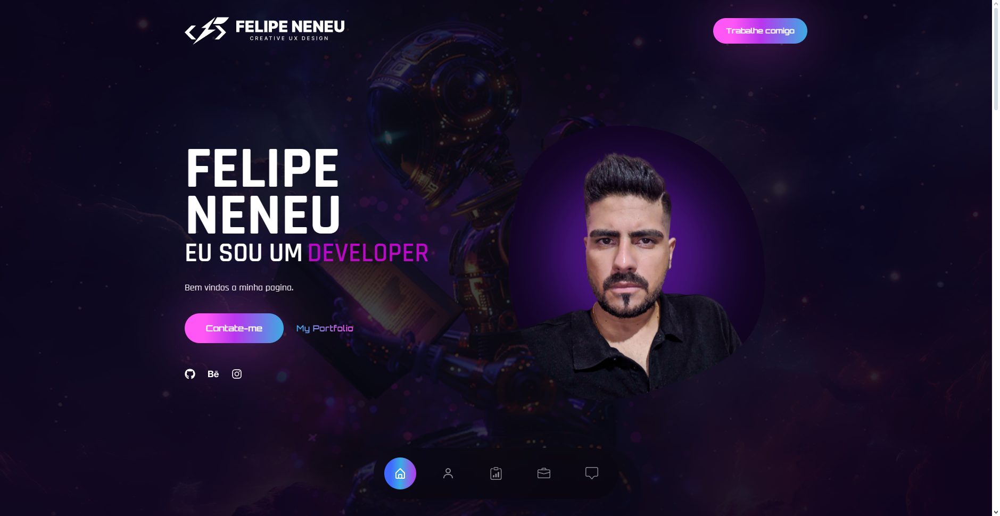
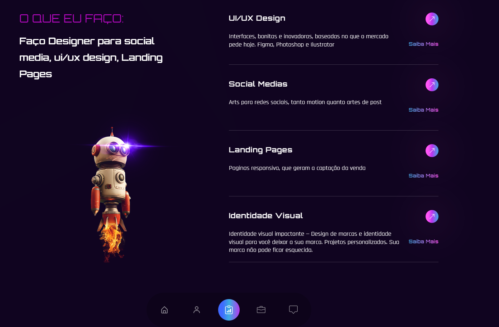

# Minha Landing Page - v. 1.00 - Em Reforma

<h1>

</h1>
 

## Sobre

Meu portifolio e landing page.

## ✨ Features
 - Motion 
 - Carrossel via Swiper (web)
 - React (web)

 ## 🚀 Tecnologias e ferramentas utilizadas
 - Front-end (web):	React, TailwindCSS, Motion e Swiper.
 ## 📟 Layout

O layout foi feito no photoshop, junto com illustrator para desenvolver o logo em svg

<h2>
©2024 - Felipe Neneu
</h2>